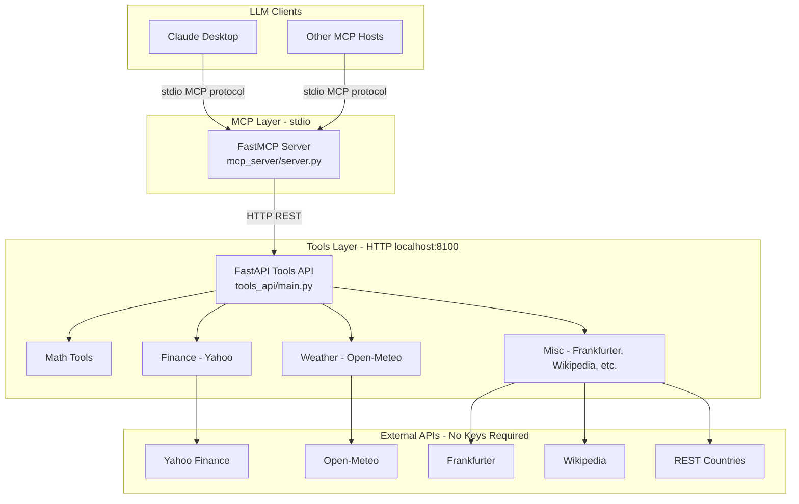
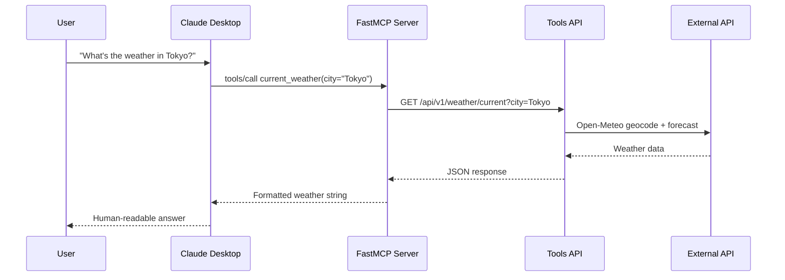
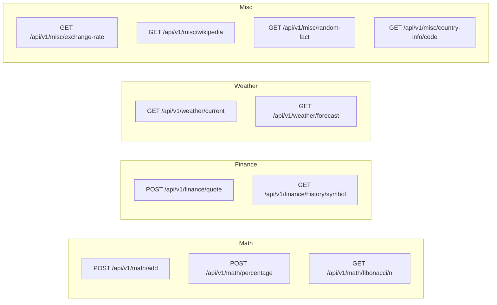
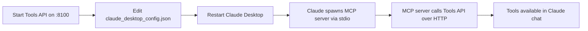
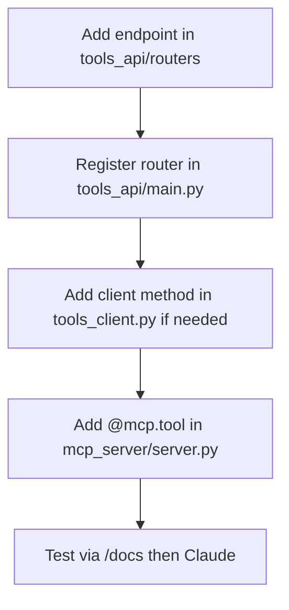
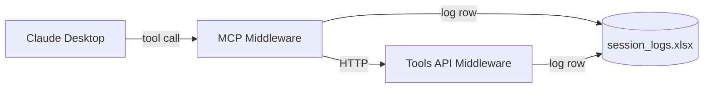

# Custom MCP Server with Tools API

A two-tier architecture that separates **tool implementations** (FastAPI REST API) from the **MCP server** (FastMCP). The MCP server exposes tools, resources, and prompts to LLM clients like Claude Desktop, while delegating actual work to a locally hosted Tools API.

## Architecture



## Project Structure

```
custom_mcp_server_with_tools/
├── venv/                          # Python virtual environment
├── requirements.txt
├── README.md
├── tools_api/                     # Local Tools API (FastAPI)
│   ├── main.py                    # App entry point
│   ├── config.py
│   └── routers/
│       ├── math_tools.py          # add, percentage, fibonacci
│       ├── finance_tools.py       # Yahoo Finance quotes & history
│       ├── weather_tools.py       # Open-Meteo current & forecast
│       └── misc_tools.py          # exchange, wikipedia, facts, countries
├── mcp_server/                      # MCP Server (FastMCP)
│   ├── server.py                  # Tools, resources, prompts
│   ├── tools_client.py            # HTTP client → Tools API
│   └── config.py
└── scripts/
    ├── start_tools_api.bat
    └── start_mcp_server.bat
```

## Request Flow



## Quick Start

### 1. Create and activate virtual environment

**Windows (PowerShell):**

```powershell
cd "c:\BSP\Agent Studio\GItHub\custom_mcp_server_with_tools"
python -m venv venv
.\venv\Scripts\Activate.ps1
pip install -r requirements.txt
```

**Windows (CMD):**

```cmd
cd "c:\BSP\Agent Studio\GItHub\custom_mcp_server_with_tools"
python -m venv venv
venv\Scripts\activate.bat
pip install -r requirements.txt
```

**macOS / Linux:**

```bash
cd custom_mcp_server_with_tools
python3 -m venv venv
source venv/bin/activate
pip install -r requirements.txt
```

### 2. Start the Tools API (Terminal 1)

```powershell
# If external APIs fail with SSL errors (common on corporate networks):
$env:TOOLS_API_SSL_VERIFY = "false"

python -m tools_api.main
```

The API runs at **http://127.0.0.1:8100**. Verify at:
- Health: http://127.0.0.1:8100/health
- Swagger docs: http://127.0.0.1:8100/docs

Or use the helper script:

```cmd
scripts\start_tools_api.bat
```

### 3. Start the MCP Server (Terminal 2)

With the Tools API running, start the MCP server (stdio mode for Claude Desktop):

```powershell
python -m mcp_server.server
```

Or:

```cmd
scripts\start_mcp_server.bat
```

> **Important:** Claude Desktop launches the MCP server itself via stdio — you do not need to run `python -m mcp_server.server` manually when using Claude Desktop. See integration steps below.

## MCP Capabilities

### Tools (12)

| Tool | Description | Backend |
|------|-------------|---------|
| `add` | Add two numbers | Tools API → `/math/add` |
| `calculate_percentage` | Calculate % of a value | Tools API → `/math/percentage` |
| `fibonacci` | First n Fibonacci numbers | Tools API → `/math/fibonacci/{n}` |
| `stock_quote` | Live stock quote | Yahoo Finance |
| `stock_history` | Historical OHLCV data | Yahoo Finance |
| `current_weather` | Current weather for a city | Open-Meteo |
| `weather_forecast` | Multi-day forecast | Open-Meteo |
| `exchange_rate` | Currency conversion | Frankfurter API |
| `wikipedia_summary` | Wikipedia article summary | Wikipedia REST |
| `random_fact` | Random interesting fact | Useless Facts API |
| `country_info` | Country details by ISO code | REST Countries |

### Resources (3)

| URI | Description |
|-----|-------------|
| `config://server` | Static server config and capability list |
| `status://health` | Live Tools API health check |
| `greeting://{name}` | Dynamic personalized greeting |

### Prompts (3)

| Prompt | Description |
|--------|-------------|
| `research_assistant` | Research workflow using Wikipedia + tools |
| `travel_planner` | Travel planning with weather + currency |
| `market_analyst` | Stock analysis workflow |

## Tools API Endpoints



### Example API calls

```powershell
# Add two numbers
curl -X POST http://127.0.0.1:8100/api/v1/math/add -H "Content-Type: application/json" -d "{\"a\": 10, \"b\": 25}"

# Stock quote
curl -X POST http://127.0.0.1:8100/api/v1/finance/quote -H "Content-Type: application/json" -d "{\"symbol\": \"AAPL\"}"

# Current weather
curl "http://127.0.0.1:8100/api/v1/weather/current?city=London"

# Exchange rate
curl "http://127.0.0.1:8100/api/v1/misc/exchange-rate?from_currency=USD&to_currency=INR&amount=100"
```

## Claude Desktop Integration

Claude Desktop connects to MCP servers over **stdio**. You must keep the **Tools API running** in the background — the MCP server depends on it.

### Step 1: Ensure Tools API is running

Start the Tools API as a background service or in a dedicated terminal before using Claude:

```powershell
cd "c:\BSP\Agent Studio\GItHub\custom_mcp_server_with_tools"
.\venv\Scripts\Activate.ps1
python -m tools_api.main
```

### Step 2: Edit Claude Desktop config

Open the Claude Desktop configuration file:

| OS | Config path |
|----|-------------|
| **Windows** | `%APPDATA%\Claude\claude_desktop_config.json` |
| **macOS** | `~/Library/Application Support/Claude/claude_desktop_config.json` |

Add your MCP server under `mcpServers`:

```json
{
  "mcpServers": {
    "custom-tools": {
      "command": "c:\\BSP\\Agent Studio\\GItHub\\custom_mcp_server_with_tools\\scripts\\run_mcp_server.bat",
      "args": [],
      "env": {
        "MCP_TOOLS_API_BASE_URL": "http://127.0.0.1:8100"
      }
    }
  }
}
```

> **Important (Windows):** Use the `run_mcp_server.bat` launcher instead of calling `python.exe -m mcp_server.server` directly. Claude Desktop may not honor the `cwd` field, which causes `ModuleNotFoundError: No module named 'mcp_server'`.

> **Note:** Use double backslashes (`\\`) in Windows paths inside JSON. Adjust paths if your project lives elsewhere.

**macOS / Linux example:**

```json
{
  "mcpServers": {
    "custom-tools": {
      "command": "/path/to/custom_mcp_server_with_tools/venv/bin/python",
      "args": ["-m", "mcp_server.server"],
      "cwd": "/path/to/custom_mcp_server_with_tools",
      "env": {
        "MCP_TOOLS_API_BASE_URL": "http://127.0.0.1:8100"
      }
    }
  }
}
```

### Step 3: Restart Claude Desktop

Fully quit and reopen Claude Desktop. You should see a hammer/tools icon indicating the MCP server is connected.

### Step 4: Verify in Claude

Try prompts like:

- "Add 42 and 58 using your tools"
- "What's the current weather in San Francisco?"
- "Get a stock quote for MSFT"
- "Convert 100 USD to EUR"
- "Tell me about Japan using country_info"

### Integration flow



## Configuration

Environment variables (optional):

| Variable | Default | Description |
|----------|---------|-------------|
| `TOOLS_API_HOST` | `127.0.0.1` | Tools API bind host |
| `TOOLS_API_PORT` | `8100` | Tools API bind port |
| `MCP_TOOLS_API_BASE_URL` | `http://127.0.0.1:8100` | URL the MCP server uses to reach Tools API |
| `MCP_SERVER_NAME` | `Custom Tools MCP Server` | Display name in MCP |
| `TOOLS_API_SSL_VERIFY` | `true` | Set to `false` on networks with SSL inspection |
| `MCP_SSL_VERIFY` | `true` | SSL verify for MCP server's outbound HTTP calls |

## Development

### Code flow summary

1. **`tools_api/routers/*.py`** — Implement tool logic (math, HTTP calls to external APIs).
2. **`tools_api/main.py`** — Register routers on FastAPI; serve at `localhost:8100`.
3. **`mcp_server/tools_client.py`** — Async HTTP client wrapping Tools API calls.
4. **`mcp_server/server.py`** — Decorate functions with `@mcp.tool`, `@mcp.resource`, `@mcp.prompt`; each tool calls `tools_client`.
5. **Claude Desktop** — Spawns `python -m mcp_server.server` over stdio; user messages trigger tool calls through the MCP protocol.

### Adding a new tool



1. Create endpoint in `tools_api/routers/`.
2. Include router in `tools_api/main.py`.
3. Add `@mcp.tool` wrapper in `mcp_server/server.py` that calls `tools_client`.

## Session Logging

Every tool call, resource read, and prompt request is logged to an Excel file.

| Column | Description |
|--------|-------------|
| Timestamp | UTC time of the interaction |
| User IP Address | Client IP (HTTP) or local machine IP (stdio MCP) |
| Host | HTTP `Host` header or machine hostname |
| Question | Tool name + arguments, API path + payload, or prompt input |
| Response | Tool result, API response body, or prompt output |

**Default log file:** `logs/session_logs.xlsx`



### Configuration

| Variable | Default | Description |
|----------|---------|-------------|
| `SESSION_LOG_ENABLED` | `true` | Enable/disable Excel logging |
| `SESSION_LOG_EXCEL_PATH` | `logs/session_logs.xlsx` | Path to the Excel log file |
| `SESSION_LOG_MAX_CELL_LENGTH` | `32000` | Max characters per cell |

## Troubleshooting

| Issue | Solution |
|-------|----------|
| MCP tools fail with connection error | Ensure Tools API is running on port 8100 |
| MCP server shows "Server disconnected" | Use `scripts/run_mcp_server.bat` in Claude config (see above) |
| Tools API port 8100 already in use | Tools API is already running — use it, or run `scripts\start_tools_api.bat` for guidance |
| Claude doesn't show tools | Check `claude_desktop_config.json` paths; restart Claude fully |
| Stock quote returns 404 | Verify ticker symbol (e.g. `AAPL`, not `Apple`) |
| Weather city not found | Use city name in English (e.g. `New York`, `Mumbai`) |
| SSL / certificate errors on external APIs | Set `TOOLS_API_SSL_VERIFY=false` before starting Tools API (corporate networks) |
| Permission error on venv activate (PowerShell) | Run `Set-ExecutionPolicy -Scope CurrentUser RemoteSigned` |

## License

MIT — use freely for learning and development.
