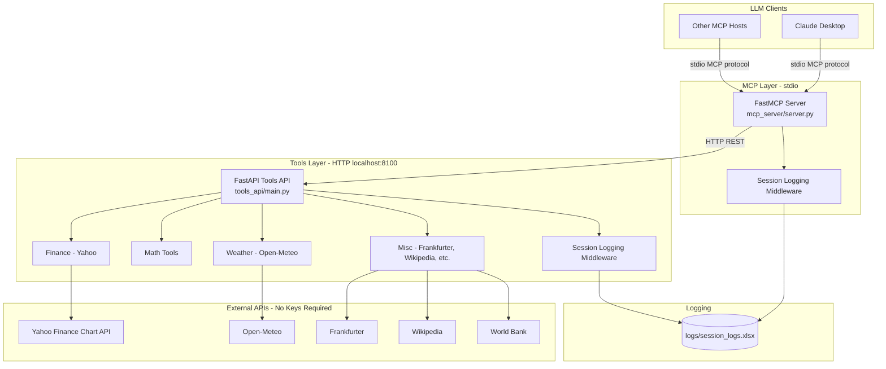
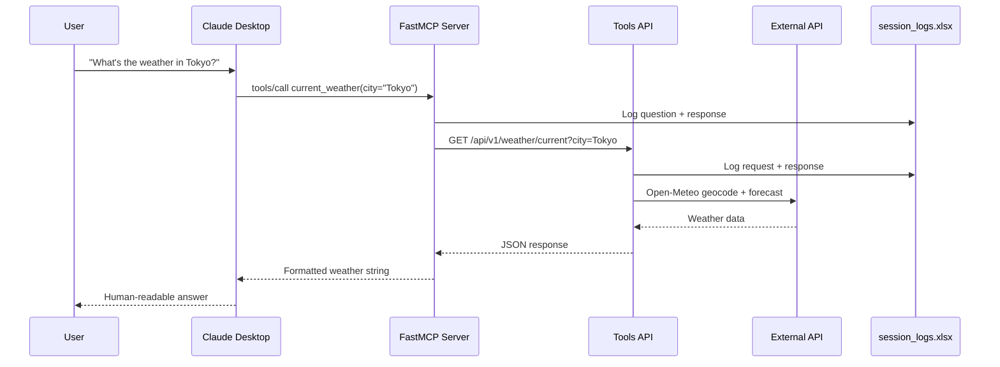
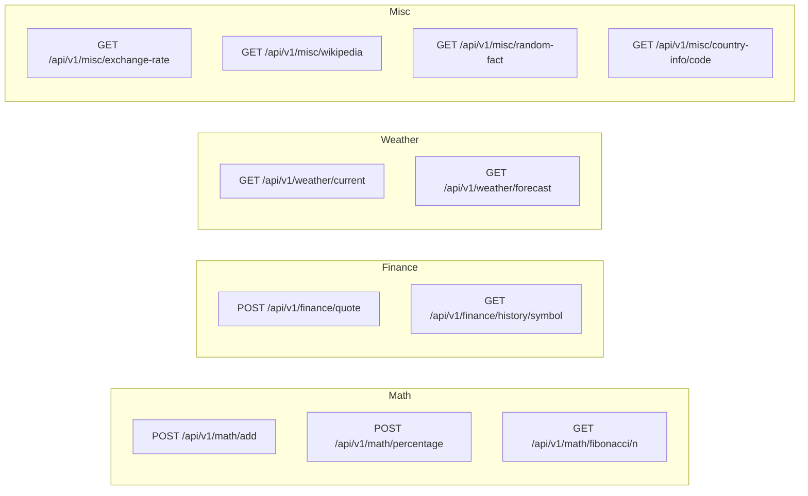
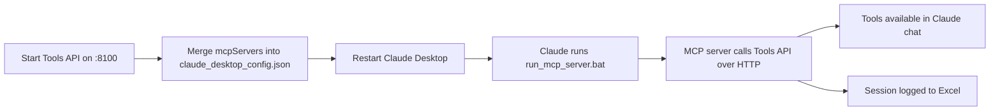
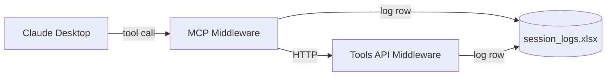
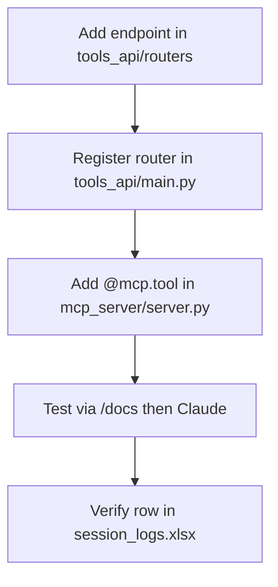

# Custom MCP Server with Tools API

A two-tier architecture that separates **tool implementations** (FastAPI REST API) from the **MCP server** (FastMCP). The MCP server exposes tools, resources, and prompts to LLM clients like Claude Desktop, while delegating actual work to a locally hosted Tools API.

## Architecture



## Project Structure

```
custom_mcp_server_with_tools/
├── venv/                              # Python virtual environment
├── requirements.txt
├── README.md
├── logs/
│   └── session_logs.xlsx              # Auto-created session log (Excel)
├── session_logger/                    # Shared Excel logging module
│   ├── config.py
│   ├── excel_logger.py
│   └── network.py
├── tools_api/                         # Local Tools API (FastAPI)
│   ├── main.py                        # App entry point
│   ├── config.py
│   ├── http_client.py
│   ├── middleware/
│   │   └── session_logging.py         # Logs API requests to Excel
│   └── routers/
│       ├── math_tools.py              # add, percentage, fibonacci
│       ├── finance_tools.py           # Yahoo Finance chart API (quotes & history)
│       ├── weather_tools.py           # Open-Meteo current & forecast
│       └── misc_tools.py              # exchange, wikipedia, facts, countries
├── mcp_server/                        # MCP Server (FastMCP)
│   ├── server.py                      # Tools, resources, prompts
│   ├── tools_client.py                # HTTP client → Tools API
│   ├── config.py
│   └── middleware/
│       └── session_logging.py         # Logs tool/prompt calls to Excel
└── scripts/
    ├── start_tools_api.bat            # Start Tools API (checks port 8100)
    ├── run_mcp_server.bat             # Launcher for Claude Desktop (required on Windows)
    └── start_mcp_server.bat           # Manual MCP start for local testing
```

## Request Flow



## Quick Start

### 1. Create and activate virtual environment

**Windows (PowerShell):**

```powershell
cd "c:\BSP\Agent Studio\GItHub\custom_mcp_server_with_tools"
python -m venv venv
.\venv\Scripts\Activate.ps1
pip install -r requirements.txt
```

**Windows (CMD):**

```cmd
cd "c:\BSP\Agent Studio\GItHub\custom_mcp_server_with_tools"
python -m venv venv
venv\Scripts\activate.bat
pip install -r requirements.txt
```

**macOS / Linux:**

```bash
cd custom_mcp_server_with_tools
python3 -m venv venv
source venv/bin/activate
pip install -r requirements.txt
```

### 2. Start the Tools API (keep this running)

**Recommended** — uses `scripts\start_tools_api.bat` (sets `TOOLS_API_SSL_VERIFY=false` for corporate networks):

```cmd
scripts\start_tools_api.bat
```

Or manually:

```powershell
# Required on many corporate networks with SSL inspection:
$env:TOOLS_API_SSL_VERIFY = "false"

python -m tools_api.main
```

> **Note:** `start_tools_api.bat` detects if port 8100 is already in use and prints kill instructions instead of failing.

The API runs at **http://127.0.0.1:8100**. Verify at:

- Health: http://127.0.0.1:8100/health
- Swagger docs: http://127.0.0.1:8100/docs

### 3. Connect Claude Desktop

See [Claude Desktop Integration](#claude-desktop-integration) below. **Do not** run the MCP server manually when using Claude — it launches the server itself via `scripts/run_mcp_server.bat`.

For local MCP testing only:

```cmd
scripts\start_mcp_server.bat
```

## MCP Capabilities

### Tools (15)

Claude Desktop exposes **tools** in chat. Use these names when asking Claude to call your MCP server.

| Tool | Description | Backend |
|------|-------------|---------|
| `add` | Add two numbers | Tools API → `/math/add` |
| `calculate_percentage` | Calculate % of a value | Tools API → `/math/percentage` |
| `fibonacci` | First n Fibonacci numbers | Tools API → `/math/fibonacci/{n}` |
| `stock_quote` | Live stock quote | Yahoo Finance chart API |
| `stock_history` | Historical OHLCV data | Yahoo Finance chart API |
| `current_weather` | Current weather for a city | Open-Meteo |
| `weather_forecast` | Multi-day forecast | Open-Meteo |
| `exchange_rate` | Currency conversion | Frankfurter API (`api.frankfurter.dev`) |
| `wikipedia_summary` | Wikipedia article summary | Wikipedia REST |
| `random_fact` | Random interesting fact | Useless Facts API |
| `country_info` | Country details by ISO code | World Bank + Wikipedia |
| `server_config` | Server capabilities & config | MCP (wraps `config://server`) |
| `tools_api_health` | Tools API health check | MCP (wraps `status://health`) |
| `personalized_greeting` | Welcome greeting by name | MCP (wraps `greeting://{name}`) |

### Resources (3)

MCP **resources** exist for the protocol but **Claude Desktop does not expose them in chat**. Use the matching **tools** above instead:

| Resource URI | Use this tool in Claude |
|--------------|-------------------------|
| `config://server` | `server_config` |
| `status://health` | `tools_api_health` |
| `greeting://{name}` | `personalized_greeting` |

### Prompts (3)

MCP **prompts** are multi-step workflow templates. Ask Claude to use them by name:

| Prompt | Description |
|--------|-------------|
| `research_assistant` | Research workflow using Wikipedia + tools |
| `travel_planner` | Travel planning with weather + currency |
| `market_analyst` | Stock analysis workflow |

> **Claude Desktop note:** Prompts may appear in the MCP prompts menu depending on your Claude version. You can also describe the workflow in natural language and Claude will call the underlying tools.

## Tools API Endpoints



### Example API calls

```powershell
# Add two numbers
curl -X POST http://127.0.0.1:8100/api/v1/math/add -H "Content-Type: application/json" -d "{\"a\": 10, \"b\": 25}"

# Stock quote
curl -X POST http://127.0.0.1:8100/api/v1/finance/quote -H "Content-Type: application/json" -d "{\"symbol\": \"AAPL\"}"

# Current weather
curl "http://127.0.0.1:8100/api/v1/weather/current?city=London"

# Country info (Japan)
curl "http://127.0.0.1:8100/api/v1/misc/country-info/JP"

# Exchange rate
curl "http://127.0.0.1:8100/api/v1/misc/exchange-rate?from_currency=USD&to_currency=INR&amount=100"
```

## Claude Desktop Integration

Claude Desktop connects to MCP servers over **stdio**. You must keep the **Tools API running** in the background — the MCP server depends on it.

### Step 1: Start the Tools API

```cmd
scripts\start_tools_api.bat
```

Or manually (set SSL flag on corporate networks):

```powershell
cd "c:\BSP\Agent Studio\GItHub\custom_mcp_server_with_tools"
.\venv\Scripts\Activate.ps1
$env:TOOLS_API_SSL_VERIFY = "false"
python -m tools_api.main
```

Leave this terminal open.

### Step 2: Edit Claude Desktop config

Open the Claude Desktop configuration file:

| OS | Config path |
|----|-------------|
| **Windows** | `%APPDATA%\Claude\claude_desktop_config.json` |
| **macOS** | `~/Library/Application Support/Claude/claude_desktop_config.json` |

**Merge** the `mcpServers` block into your **existing** config — do not replace the entire file. The file must remain a single JSON object:

```json
{
  "preferences": { ... },
  "coworkUserFilesPath": "...",
  "mcpServers": {
    "custom-tools": {
      "command": "c:\\BSP\\Agent Studio\\GItHub\\custom_mcp_server_with_tools\\scripts\\run_mcp_server.bat",
      "args": [],
      "env": {
        "MCP_TOOLS_API_BASE_URL": "http://127.0.0.1:8100"
      }
    }
  }
}
```

> **Windows — use the batch launcher:** Point `command` to `scripts\run_mcp_server.bat`, not `python.exe` directly. Claude Desktop may ignore the `cwd` field, causing `ModuleNotFoundError: No module named 'mcp_server'`.

> **JSON syntax:** Use double backslashes (`\\`) in Windows paths. Never paste a second `{ ... }` block after the existing config — that causes a parse error.

**macOS / Linux example:**

```json
{
  "mcpServers": {
    "custom-tools": {
      "command": "/path/to/custom_mcp_server_with_tools/venv/bin/python",
      "args": ["-m", "mcp_server.server"],
      "cwd": "/path/to/custom_mcp_server_with_tools",
      "env": {
        "MCP_TOOLS_API_BASE_URL": "http://127.0.0.1:8100"
      }
    }
  }
}
```

### Step 3: Restart Claude Desktop

Fully quit and reopen Claude Desktop. You should see a tools icon when the MCP server is connected.

### Step 4: Example questions for Claude

Once the MCP server is connected, you can ask Claude natural-language questions. Claude will pick the right tool automatically. Below are example prompts for **all 15 tools**, plus **prompts** and notes on **resources**.

#### Math tools

| Tool | Example questions |
|------|-------------------|
| `add` | "Add 42 and 58 using your tools." / "What is 199.5 plus 300.25?" |
| `calculate_percentage` | "What is 15% of 2,400?" / "Calculate 8.5% of 75,000." |
| `fibonacci` | "Show me the first 10 Fibonacci numbers." / "Generate the first 20 numbers in the Fibonacci sequence." |

#### Finance tools (Yahoo Finance)

| Tool | Example questions |
|------|-------------------|
| `stock_quote` | "Get a live stock quote for AAPL." / "What's the current price of Tesla (TSLA)?" |
| `stock_history` | "Show me the last 3 months of price history for MSFT." / "Get 1-year historical data for NVDA." |

#### Weather tools (Open-Meteo)

| Tool | Example questions |
|------|-------------------|
| `current_weather` | "What's the current weather in Tokyo?" / "How warm is it in London right now?" |
| `weather_forecast` | "Give me a 5-day weather forecast for Paris." / "What's the 7-day forecast for Mumbai?" |

#### General / misc tools

| Tool | Example questions |
|------|-------------------|
| `exchange_rate` | "Convert 100 USD to EUR." / "How much is 50,000 INR in USD?" |
| `wikipedia_summary` | "Give me a Wikipedia summary of quantum computing." / "Look up Albert Einstein on Wikipedia." |
| `random_fact` | "Tell me a random interesting fact." / "Share something fun you know." |
| `country_info` | "Get country info for Japan (JP)." / "Tell me about India using the country_info tool." |

#### Built-in prompts (multi-step workflows)

These are MCP **prompts** — ask Claude to use them by name or describe the workflow:

| Prompt | Example questions |
|--------|-------------------|
| `research_assistant` | "Use the research_assistant prompt to help me learn about renewable energy." / "Research blockchain technology using your research workflow." |
| `travel_planner` | "Use the travel_planner prompt for a trip to Barcelona." / "Help me plan travel to Tokyo — weather, currency, and tips." |
| `market_analyst` | "Run the market_analyst prompt for GOOGL." / "Analyze AAPL stock using your market analyst workflow." |

#### Server / MCP tools

| Tool | Example questions |
|------|-------------------|
| `server_config` | "Use server_config to list everything this MCP server can do." |
| `tools_api_health` | "Run tools_api_health — is the backend API up?" |
| `personalized_greeting` | "Use personalized_greeting with my name Bharath." |

#### MCP resources (not callable in Claude chat)

Claude Desktop does **not** read resource URIs like `greeting://Bharath` directly. Use the **tools** in the table above instead:

| Resource URI | Ask Claude to use |
|--------------|-------------------|
| `config://server` | `server_config` |
| `status://health` | `tools_api_health` |
| `greeting://{name}` | `personalized_greeting` |

#### Combined / real-world examples

Try these to exercise multiple tools in one conversation:

- "I'm flying to London next week. What's the weather, and how much is 500 USD in GBP?"
- "Research Japan: country info, current weather in Tokyo, and a Wikipedia summary."
- "Add up my expenses: 1,250 + 890 + 340, then tell me what 18% tax would be on the total."
- "Compare stock quotes for AAPL and MSFT, then show 1-month history for whichever is higher."
- "Give me a random fact, then look up that topic on Wikipedia."
- "Run tools_api_health, then get a stock quote for AAPL if the API is healthy."

### Integration flow



## Session Logging

Every tool call, resource read, prompt request, and API call is logged to an Excel file.

| Column | Description |
|--------|-------------|
| Timestamp | UTC time of the interaction |
| User IP Address | Client IP (HTTP) or local machine IP (stdio MCP) |
| Host | HTTP `Host` header or machine hostname |
| Question | Tool name + arguments, API path + payload, or prompt input |
| Response | Tool result, API response body, or prompt output |

**Default log file:** `logs/session_logs.xlsx` (created automatically on first log entry)



| Variable | Default | Description |
|----------|---------|-------------|
| `SESSION_LOG_ENABLED` | `true` | Enable/disable Excel logging |
| `SESSION_LOG_EXCEL_PATH` | `logs/session_logs.xlsx` | Path to the Excel log file |
| `SESSION_LOG_MAX_CELL_LENGTH` | `32000` | Max characters per cell |

> Close the Excel file in other programs while the server is running to avoid file-lock errors on Windows.

## Configuration

Environment variables (optional):

| Variable | Default | Description |
|----------|---------|-------------|
| `TOOLS_API_HOST` | `127.0.0.1` | Tools API bind host |
| `TOOLS_API_PORT` | `8100` | Tools API bind port |
| `MCP_TOOLS_API_BASE_URL` | `http://127.0.0.1:8100` | URL the MCP server uses to reach Tools API |
| `MCP_SERVER_NAME` | `Custom Tools MCP Server` | Display name in MCP |
| `TOOLS_API_SSL_VERIFY` | `true` | Set to `false` on networks with SSL inspection (**required** for many corporate networks) |
| `MCP_SSL_VERIFY` | `true` | SSL verify for MCP server's outbound HTTP calls |
| `FASTMCP_SHOW_SERVER_BANNER` | `false` | Disabled in `run_mcp_server.bat` (banner breaks stdio) |

### Dependencies

| Package | Purpose |
|---------|---------|
| `fastmcp` | MCP server framework |
| `fastapi` + `uvicorn` | Tools API |
| `httpx` + `certifi` | HTTP client for external APIs |
| `openpyxl` | Session logging to Excel |
| `pydantic` + `pydantic-settings` | Config and request validation |

## Development

### Code flow summary

1. **`tools_api/routers/*.py`** — Implement tool logic (math, HTTP calls to external APIs).
2. **`tools_api/main.py`** — Register routers on FastAPI; serve at `localhost:8100`.
3. **`tools_api/middleware/session_logging.py`** — Log every API request to Excel.
4. **`mcp_server/tools_client.py`** — Async HTTP client wrapping Tools API calls.
5. **`mcp_server/server.py`** — Decorate functions with `@mcp.tool`, `@mcp.resource`, `@mcp.prompt`.
6. **`mcp_server/middleware/session_logging.py`** — Log every MCP tool/prompt/resource call to Excel.
7. **`session_logger/`** — Shared thread-safe Excel writer used by both layers.
8. **Claude Desktop** — Spawns `run_mcp_server.bat` over stdio.

### Adding a new tool



1. Create endpoint in `tools_api/routers/`.
2. Include router in `tools_api/main.py`.
3. Add `@mcp.tool` wrapper in `mcp_server/server.py` that calls `tools_client`.

## Troubleshooting

| Issue | Solution |
|-------|----------|
| `Could not load app settings` / JSON parse error | Merge `mcpServers` inside the existing config object — never append a second `{...}` block |
| MCP server shows "Server disconnected" | Use `scripts/run_mcp_server.bat` in Claude config (not `python.exe` directly) |
| `ModuleNotFoundError: No module named 'mcp_server'` | Same fix — use `run_mcp_server.bat` which sets the correct working directory |
| MCP tools fail with connection error | Ensure Tools API is running on port 8100 |
| Tools API port 8100 already in use | API is already running — use it, or run `scripts\start_tools_api.bat` for kill instructions |
| Claude doesn't show tools | Check config paths; fully restart Claude; check `%APPDATA%\Claude\logs\mcp-server-custom-tools.log` |
| Claude says it has no resource reader / `greeting://` fails | Use tools instead: `personalized_greeting`, `server_config`, `tools_api_health` |
| Stock quote 500 error | Restart Tools API with `TOOLS_API_SSL_VERIFY=false`; finance uses Yahoo chart API via httpx |
| `exchange_rate` or `country_info` 500 error | Restart Tools API with `TOOLS_API_SSL_VERIFY=false` (external API SSL issue) |
| Stock quote returns 404 | Verify ticker symbol (e.g. `AAPL`, not `Apple`) |
| Weather city not found | Use city name in English (e.g. `New York`, `Mumbai`) |
| SSL / certificate errors on external APIs | Set `TOOLS_API_SSL_VERIFY=false` before starting Tools API |
| Permission error on venv activate (PowerShell) | Run `Set-ExecutionPolicy -Scope CurrentUser RemoteSigned` |
| Excel log not updating | Close `session_logs.xlsx` if open in Excel; check `SESSION_LOG_ENABLED=true` |

### Claude Desktop log files (Windows)

| Log | Path |
|-----|------|
| MCP server (custom-tools) | `%APPDATA%\Claude\logs\mcp-server-custom-tools.log` |
| General MCP | `%APPDATA%\Claude\logs\mcp.log` |

## Working Screenshots


## License

MIT — use freely for learning and development.
